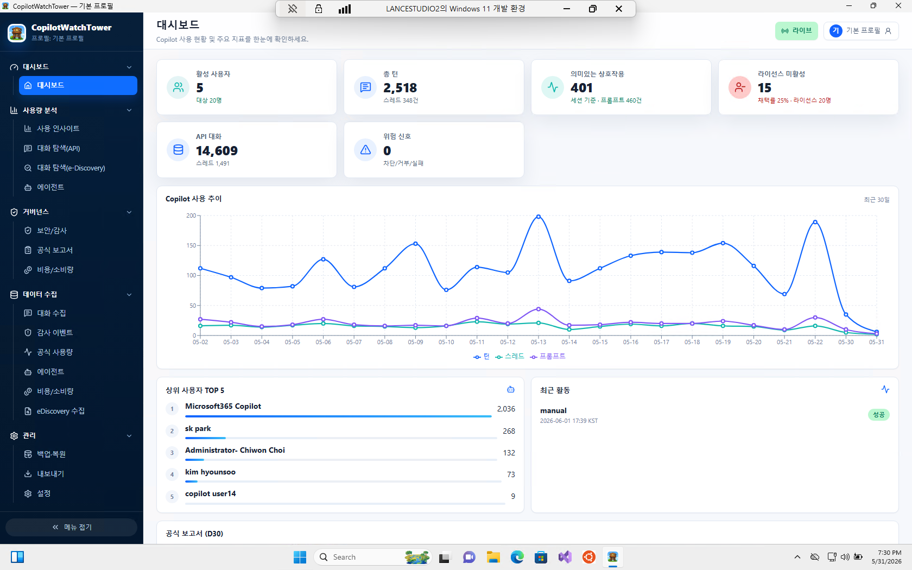
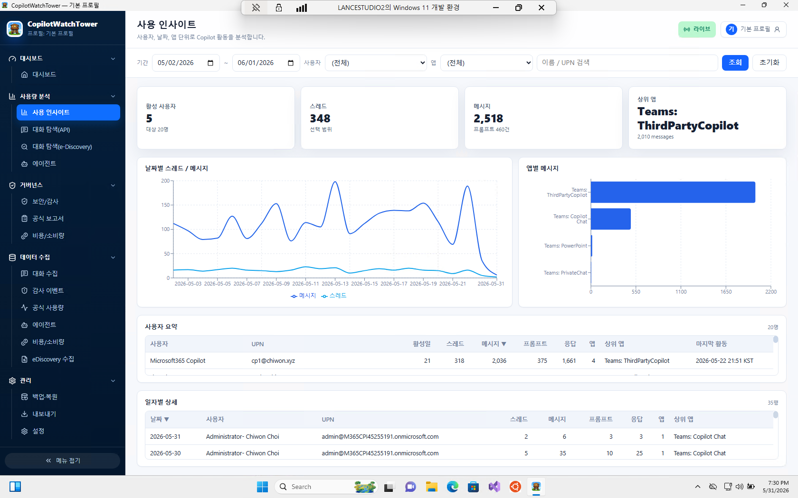
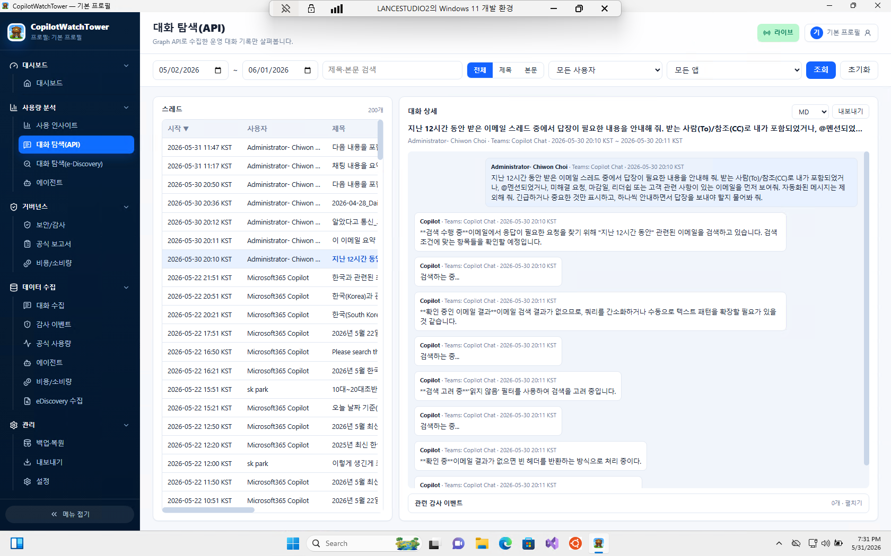

# CopilotWatchTower (코파일럿 워치타워)

> 테넌트 관리자를 위한 **Microsoft 365 Copilot 사용 현황·대화 수집 도구** — Python + PySide6로 제작한 Windows 데스크톱 앱입니다.

리포지토리: <https://github.com/microsoft/CopilotWatchTower>

---

## 한눈에 보기

**CopilotWatchTower**는 조직(테넌트) 안에서 직원들이 Microsoft 365 Copilot을
**어떻게, 얼마나 사용하고 있는지** 관리자가 직접 수집하고 분석할 수 있게 해 주는
도구입니다.

- 관리자의 PC 한 대에서만 동작합니다. 별도 서버나 외부로 열린 네트워크 포트가 필요 없습니다.
- Microsoft Graph API
  (`/beta/copilot/users/{id}/interactionHistory/getAllEnterpriseInteractions`)로
  테넌트의 Copilot 상호작용 기록을 가져와 **내 PC 안의 로컬 데이터베이스(SQLite)** 에
  저장합니다.
- 저장한 데이터를 대시보드, 차트, 대화 검색, CSV/Excel 내보내기 등으로
  **컴플라이언스(감사)·분석** 용도로 활용할 수 있습니다.

쉽게 말해, "우리 회사 직원들이 Copilot을 실제로 쓰고 있나? 누가 많이 쓰나?
어떤 앱(Teams, Word 등)에서 쓰나? 라이선스는 낭비되고 있지 않나?" 같은 질문에
**숫자와 근거**로 답하기 위한 관리 도구입니다.

> ⚠️ **컴플라이언스 주의사항.** 이 도구는 Copilot 대화 내용을 **평문(원문) 그대로**
> 읽어 옵니다. eDiscovery, 내부 감사, 규제 보관 등 **법적·정책적으로 명확한 권한이
> 있는 테넌트에서만** 사용하세요. 도입 전에 개인정보 영향평가(DPIA)와 데이터 취급
> 정책을 반드시 검토해야 합니다.

---

## 주요 화면

### 1. 대시보드 — 전체 사용 현황을 한눈에

활성 사용자 수, 총 스레드/메시지/프롬프트, 의미 있는 상호작용, 라이선스 미활용
인원 등 핵심 지표(KPI)와 최근 30일 사용 추이 그래프, 상위 사용자 TOP 5를
보여 줍니다.



### 2. 사용 인사이트 — 사용자·날짜·앱별 상세 분석

기간·사용자·앱별로 Copilot 활동을 필터링해 분석합니다. 날짜별 스레드/메시지
추이, 앱별(Teams Copilot Chat, ThirdPartyCopilot 등) 메시지 분포, 사용자별
요약 표를 제공합니다.



### 3. 대화 탐색 — 실제 대화 기록 열람

Graph API로 수집한 운영 대화 기록을 제목·본문으로 검색하고, 사용자/앱별로
필터링해 개별 대화의 전체 내용을 확인합니다. 관련 감사 이벤트와 함께
Markdown 등으로 내보낼 수 있습니다.



---

## 핵심 기능

- **사전 앱 등록이 필요 없습니다.** 첫 실행 시 안내 마법사가 디바이스 코드
  로그인(잘 알려진 Microsoft Graph PowerShell 클라이언트 사용)으로 테넌트에
  Entra ID 애플리케이션을 **자동 등록**하고, `AiEnterpriseInteraction.Read.All`,
  `User.Read.All`, `Organization.Read.All` **애플리케이션 권한**을 부여하며,
  관리자 동의 URL을 브라우저로 열어 줍니다. 클라이언트 비밀은 Windows DPAPI로
  안전하게 보관합니다.
- **테넌트 전체 수집** — 다음 4가지 범위 모드를 지원합니다.
  - `LICENSED` — Copilot 라이선스 보유 사용자 (기본값, 권장)
  - `ALL_ACTIVE` — 테넌트의 모든 활성 사용자
  - `GROUP` — 특정 Entra 그룹의 멤버
  - `CUSTOM` — 직접 지정한 UPN 목록
- **중단되어도 안전한 증분 수집.** 사용자별 워터마크(`createdDateTime` 필터)에
  300초 안전 여유를 두고, `Retry-After`를 준수하며, 지수 백오프와 멱등성
  업서트로 재실행해도 데이터가 중복되지 않습니다.
- **로컬 전용 저장소.** `%LOCALAPPDATA%\CopilotWatchTower\store.db` SQLite에
  저장하며, 대화 본문에 대한 FTS5 전문 검색을 지원합니다.
- **현대적인 Qt UI** — 대시보드(KPI + 차트), 대화 탐색, 실시간 수집 로그
  모니터링, CSV/JSON/XLSX 내보내기.
- **한국어 / 영어 다국어 지원** (Qt Linguist `.ts` 파일).

---

## 설치하기 (일반 사용자)

배포용 설치 패키지를 사용하는 경우, [Releases](https://github.com/microsoft/CopilotWatchTower/releases)
페이지에서 `CopilotWatchTower-x.y.z-setup.zip`을 내려받으세요. 압축을 풀면 다음이
들어 있습니다.

- `CopilotWatchTower.msix` — 앱 설치 패키지
- `CopilotWatchTower.cer` — 서명 인증서 (자체 서명)
- `Install-CopilotWatchTower.bat` — 인증서 신뢰 등록 + 앱 설치 (관리자 권한)
- `Uninstall-CopilotWatchTower.bat` — 앱 제거
- `INSTALL.txt` — 설치 안내문

> 자체 서명 인증서를 사용하므로 설치 전에 인증서를 신뢰할 수 있는 항목으로
> 등록해야 합니다. 자세한 절차는 압축 안의 `INSTALL.txt`를 참고하세요.

---

## 개발자 모드로 실행하기

```powershell
# 1. Python 3.11+ 가상환경 생성
py -3.11 -m venv .venv
.\.venv\Scripts\Activate.ps1

# 2. 개발 의존성 포함 editable 설치
pip install -e ".[dev]"

# 3. 실행
copilot-watchtower
#   …또는:  python -m copilot_watchtower
```

첫 실행 시 **온보딩 마법사**가 다음 단계를 안내합니다.

1. **디바이스 코드** — 관리자 동의가 가능한 테넌트 관리자(전역 관리자, 권한 있는
   역할 관리자, 클라우드 애플리케이션 관리자, 애플리케이션 관리자)로 로그인합니다.
2. **앱 등록** — 도구가 `/applications`에 POST하여 서비스 주체를 만들고
   180일 클라이언트 비밀을 추가합니다.
3. **관리자 동의** — 브라우저에 동의 화면이 열리고, 도구는 임의의 루프백
   포트에서 콜백을 수신합니다.
4. **완료** — 마법사가 `tenant_id`, `client_id`, DPAPI로 보호된 비밀을 저장하고
   부트스트랩 완료로 표시합니다.

이후 실행부터는 곧바로 메인 창으로 진입해 수집을 재개합니다.

---

## Windows MSIX 빌드하기

```powershell
pip install pyinstaller
pyinstaller packaging\copilot-watchtower.spec --clean --noconfirm
# dist\CopilotWatchTower\* 와 packaging\AppxManifest.xml, Assets\ 폴더를
# 함께 둔 뒤:
makeappx pack /d msix-staging /p CopilotWatchTower.msix
signtool sign /fd SHA256 /a CopilotWatchTower.msix
```

프로덕션 배포 시에는 `packaging/AppxManifest.xml`을 코드 서명 인증서의
주체(subject)에 맞게 수정한 뒤 패키징하세요.

> 한 번에 빌드·서명·패키징하려면 `packaging/build-msix.ps1` 스크립트를
> 사용할 수 있습니다.

---

## 필요한 Microsoft Graph 권한

| 권한                                          | 유형        | 용도                                         |
| --------------------------------------------- | ----------- | -------------------------------------------- |
| `AiEnterpriseInteraction.Read.All`            | 애플리케이션 | 모든 사용자의 Copilot 상호작용 읽기          |
| `User.Read.All`                               | 애플리케이션 | 사용자 및 Copilot 라이선스 보유자 열거       |
| `Organization.Read.All`                       | 애플리케이션 | 구독 SKU를 읽어 Copilot 식별                 |
| `Application.ReadWrite.All` (위임)            | 위임        | 부트스트랩: 앱 등록 생성                      |
| `AppRoleAssignment.ReadWrite.All` (위임)      | 위임        | 부트스트랩: 앱 권한 할당                      |
| `Directory.Read.All` (위임)                   | 위임        | 부트스트랩: 테넌트 정보 읽기                  |

---

## 데이터 위치 & 보관

| 항목              | 경로                                                |
| ----------------- | --------------------------------------------------- |
| SQLite DB (+WAL)  | `%LOCALAPPDATA%\CopilotWatchTower\store.db`          |
| 앱 로그           | `%LOCALAPPDATA%\CopilotWatchTower\logs\app.log`      |
| 감사 로그         | `%LOCALAPPDATA%\CopilotWatchTower\logs\audit.log`    |

저장된 자격 증명과 데이터를 삭제하려면 **설정 → 위험 영역 → 앱 등록 및 데이터 삭제**
를 사용하세요. Entra ID 앱 등록 자체는
[Entra 포털 → 앱 등록](https://entra.microsoft.com/)에서 직접 제거해야 합니다.

---

## 테스트

```powershell
pip install -e ".[dev]"
pytest -q
```

테스트는 저장소(CRUD + FTS), DPAPI 왕복, 내보내기 형식, 그리고
`httpx.MockTransport`를 통한 Graph 클라이언트 재시도/페이지네이션 로직을
다룹니다.

---

## 아키텍처

```
┌───────────────────────────────┐
│ PySide6 UI (메인 스레드)       │
│  ├─ MainWindow / 사이드바      │
│  ├─ 대시보드 (QtCharts)        │
│  ├─ 대화 탐색 (FTS)            │
│  ├─ 모니터링 (실시간 로그)     │
│  └─ 내보내기                   │
└──────────────┬────────────────┘
               │ signals/slots
┌──────────────▼────────────────┐
│ CollectorWorker (QThread)     │
│  ├─ 범위(scope) 결정          │
│  ├─ 사용자별 list_interactions│
│  └─ 배치 업서트               │
└──────────────┬────────────────┘
               │
┌──────────────▼────────────────┐  ┌──────────────────────────┐
│ GraphClient (httpx)           │  │ Repository (SQLite+FTS5) │
│  재시도 / 페이지네이션 / 429   │  │ DPAPI로 보호된 비밀      │
└───────────────────────────────┘  └──────────────────────────┘
```

---

## 라이선스

MIT — [LICENSE](LICENSE) 참고.
